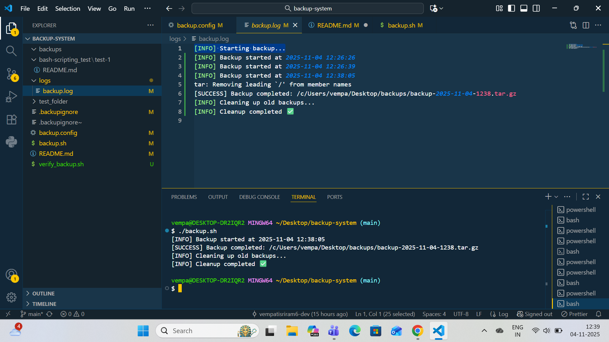
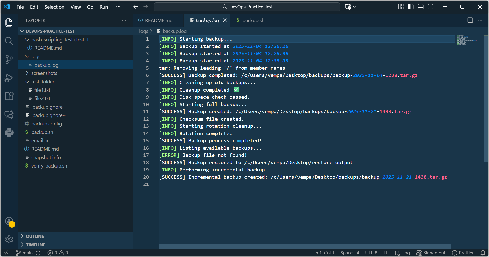

# Automated Backup System (Bash Script Project)
      
*  A simple Bash-based backup automation system that creates compressed backups, verifies them using checksums, and automatically removes old backups based on a rotation policy.

*  It helps users automate local backups efficiently with a single command.

---

#  A. Project Overview

### What Does This Script Do?

* This project automates the backup of a chosen folder by:

* Compressing the target directory into a .tar.gz archive

* Generating a SHA256 checksum to ensure file integrity

* Skipping unwanted folders like .git, node_modules, and .cache

* Automatically rotating backups (keeping only the latest 7 daily, 4 weekly, and 3 monthly backups)

* Logging every backup operation into logs/backup.log

### Why It’s Useful

- Manual backups are time-consuming and prone to human error.
This automation script:

* Keeps your files safe automatically

* Saves disk space using rotation

* Provides clear logs for troubleshooting

* Can be easily customized for any system

# B. How to Use It (Step-by-Step)

### Step 1: Prerequisites

- Make sure you have:

* Git Bash on Windows or Terminal on Linux/Mac

* tar and sha256sum utilities (installed by default on most systems)

### Step 2: Clone the Repository

```
 git clone https://github.com/vempatisriram6-dev/DevOps-Practice-Test.git
  
 cd backup-system

```

### Step 3: Configure the Backup

```
 BACKUP_SOURCE="/c/Users/vempa/Desktop/test_folder"
 
 BACKUP_DESTINATION="/c/Users/vempa/Desktop/backups"
 
 LOG_FILE="./logs/backup.log"

 EXCLUDE_PATTERNS=".git,node_modules,.cache"

 DAILY_KEEP=7
 WEEKLY_KEEP=4
 MONTHLY_KEEP=3

```

### Step 4: Run the Backup
```
 ./backup.sh
```

- This will:

* Create a new backup in your destination folder

* Save logs in logs/backup.log

* Display success/failure messages in the terminal

### Step 5: Verify the Backup

* To verify that the backup was created and matches its checksum:
```
 ./verify_backup.sh backup-YYYY-MM-DD-HHMM.tar.gz
```

- If verification passes:
```
 [SUCCESS] Checksum verified successfully
```

### Step 6: Check Logs

- All activities (start, success, cleanup, errors) are stored here:
```
 logs/backup.log
```
### Step 7: Restore a Backup

* Command:
  
  ```
  ./backup.sh --restore backup-2025-01-20-1032.tar.gz --to /home/user/output
  ```
* Output:

   ```
    [SUCCESS] Backup restored to /home/user/output
   
    ```
### Step 8: List All Backups 

* Command:
  
   ```
   ./backup.sh --list
   
   ```
* Output:

   ```
    [INFO] Listing available backups...
    -rw-r--r-- 1 user user 5.2M Jan 20 10:32 backup-2025-01-20-1032.tar.gz
    -rw-r--r-- 1 user user 5.3M Jan 19 10:22 backup-2025-01-19-1022.tar.gz
  
  ``` 
 ### Step 9: Email Notification (Simulated)
 
* The script writes a message to:

```
 email.txt

```
* Example output in email.txt:
  
```
Backup Completed Successfully at Mon Jan 20 10:32:12 IST 2025

```
### Step 10: Perform Incremental Backup

* Command:
```
 ./backup.sh --incremental
 
```
* Output:

```
[INFO] Performing incremental backup...
[SUCCESS] Incremental backup created: /backups/backup-2025-xx.tar.gz
```
* Files Created:

```
snapshot.info
backup-2025-xx.tar.gz
backup-2025-xx.tar.gz.sha256

```

 
### Example backup.log:


```
[INFO] Starting backup...
[INFO] Backup started at 2025-11-04 12:26:26
[INFO] Backup started at 2025-11-04 12:26:39
[INFO] Backup started at 2025-11-04 12:38:05
tar: Removing leading `/' from member names
[SUCCESS] Backup completed: /c/Users/vempa/Desktop/backups/backup-2025-11-04-1238.tar.gz
[INFO] Cleaning up old backups...
[INFO] Cleanup completed 
[INFO] Disk space check passed.
[INFO] Starting full backup...
[SUCCESS] Backup created: /c/Users/vempa/Desktop/backups/backup-2025-11-21-1433.tar.gz
[INFO] Checksum file created.
[INFO] Starting rotation cleanup...
[INFO] Rotation complete.
[SUCCESS] Backup process completed!
[INFO] Listing available backups...
[ERROR] Backup file not found!
[SUCCESS] Backup restored to /c/Users/vempa/Desktop/restore_output
[INFO] Performing incremental backup...
[SUCCESS] Incremental backup created: /c/Users/vempa/Desktop/backups/backup-2025-11-21-1438.tar.gz

```
---

### Step 11: Folder Structure

```
DevOps-Practice-Test/
├── backup.sh                 # Main backup script (full + incremental + restore + list)
├── verify_backup.sh          # Checksum verification script
├── backup.config             # Configuration file
├── logs/
│   └── backup.log            # Log file (auto-generated)
├── screenshots/
│   ├── backup-output.png     # Screenshot 1: Backup output
│   └── backup-output-2.png   # Screenshot 2: Additional backup output
├── test_folder/              # Sample folder for testing backups
├── email.txt                 # Simulated email notifications
├── snapshot.info             # Tar snapshot file for incremental backups
└── README.md                 # Full project documentation

```

---

### Step 12: Example Output (Screenshot)





---

### Step 13: Automation (Optional)

* You can automate this with Windows Task Scheduler or Linux cron jobs.

- Example cron entry (Linux):

```

 0 2 * * * /path/to/backup-system/backup.sh

```
 ---

# C. How It Works:
▸ Rotation Algorithm

▸ The script:

* Keeps only the 7 most recent daily backups

* Keeps only the 4 most recent weekly backups

* Keeps only the 3 most recent monthly backups

* Deletes older ones automatically

* This saves disk space while ensuring recovery options.

### Checksum Creation

- For every backup, a .sha256 file is created:

```
 sha256sum backup.tar.gz > backup.tar.gz.sha256

```

 - You can recheck integrity anytime using:

```
sha256sum -c backup.tar.gz.sha256

```

# D. Design Decisions

* Simple and portable Bash scripting

* No dependency on third-party tools

* Ideal for beginners learning Linux + DevOps automation

#### Challenges Faced:

*  Windows compatibility for Git Bash

* Managing path conversions (/c/Users/... vs C:\Users\...)

* Proper logging and simultaneous screen display

#### How They Were Solved

* Used consistent POSIX-style paths

* Implemented dual logging using tee command

* Added checksum validation to verify backup integrity

#  E. Testing

```

| Test                     | Description                          | Result            |
|--------------------------|--------------------------------------|-------------------|
| Backup creation          | Run `./backup.sh`                    | Success           |
| Backup rotation          | Created multiple backups             | Old backups removed correctly |
| Checksum verification    | Run `./verify_backup.sh file.tar.gz` | Passed            |
| Excluded patterns        | `.git`, `node_modules`, `.cache`     | Ignored as expected |
| Error handling           | Tried non-existent source folder     | Gracefully handled |
| Log generation           | Checked `logs/backup.log`            | All events recorded |
| Integrity check failure  | Modified backup intentionally         | Error detected     |
```
---
 # F. Known Limitations

* Script doesn’t handle remote/cloud backups yet (local only)

* tar compression speed may be slow for very large files

* Rotation works by filename date, not by file size

* No real-time progress bar (can be added later)

 ---

# Future Improvements:

* Add remote upload support (AWS S3 / Google Drive)

* Add email notifications after each backup

* Add restore.sh to unpack backups automatically

* Integrate with cron logs or systemd timers

 ---

#  Example  Summary:
```
| Command                                   | Description                      |
|-------------------------------------------|----------------------------------|
| ./backup.sh                               | Create a new backup              |
| ./verify_backup.sh backup-file.tar.gz     | Verify checksum                  |
| cat logs/backup.log                       | View backup logs                 |
| ls /c/Users/vempa/Desktop/backups         | View all backups                 |
| ./push_all.sh                             | (Optional) Commit + push to GitHub |

```
---
# Author:

```
## Author
**Name:** V. Sriram  
**GitHub:** https://github.com/vempatisriram6-dev/DevOps-Practice-Test  
**Project:** DevOps Practice Test Repository

```


